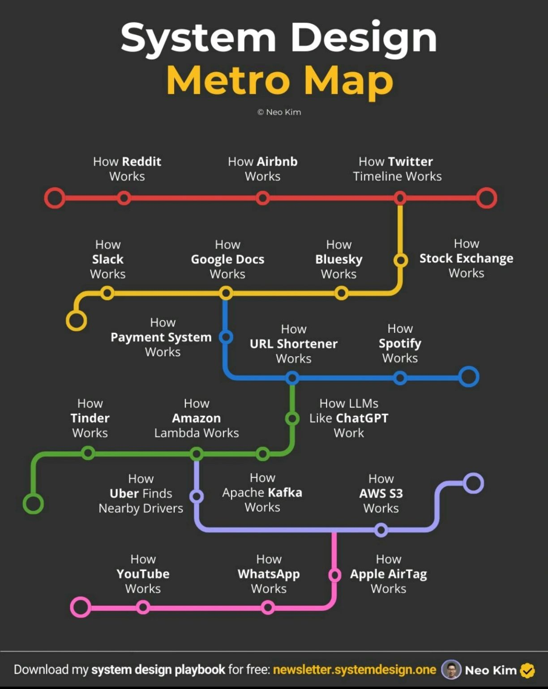

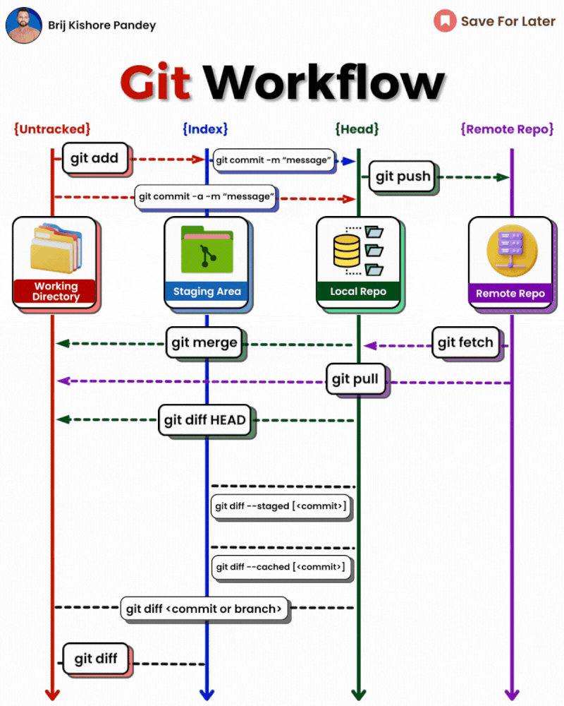

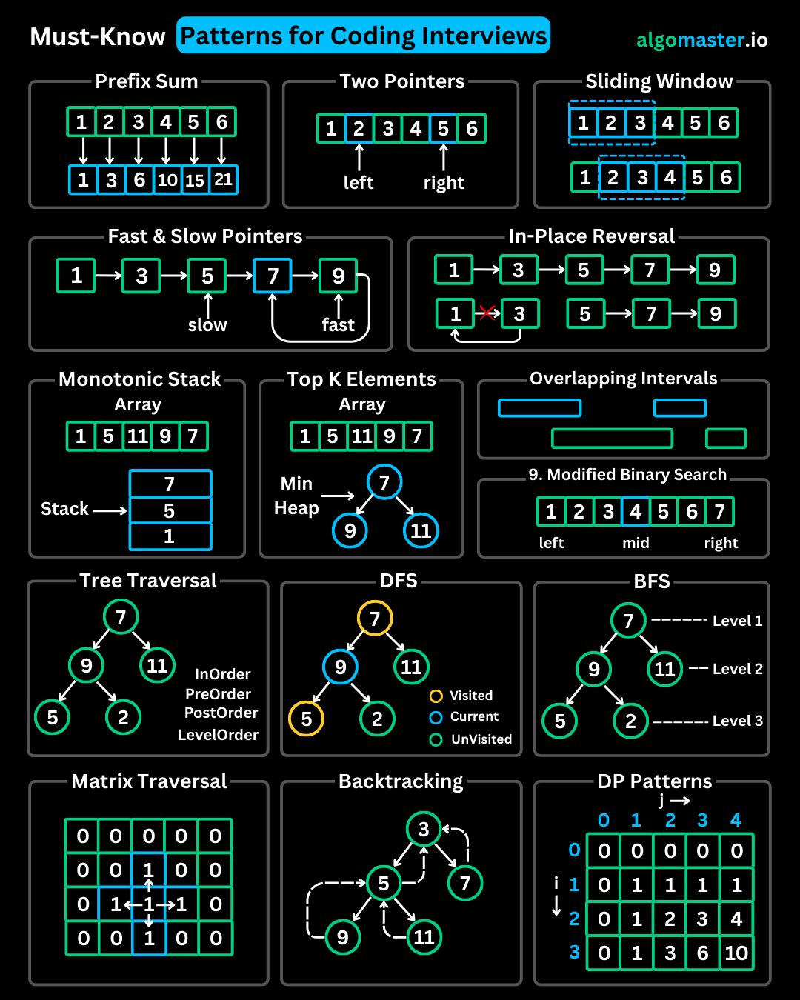

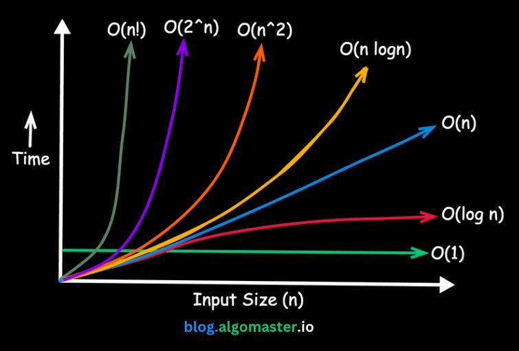

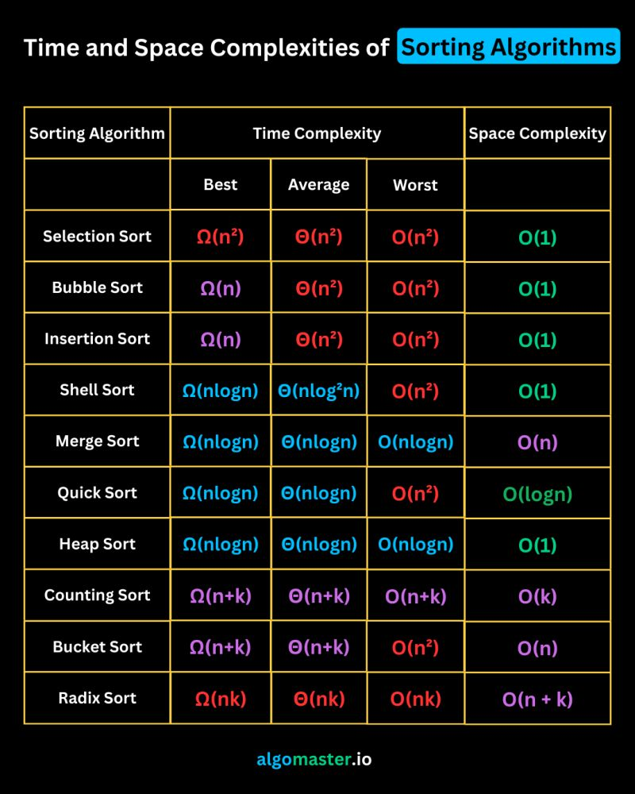

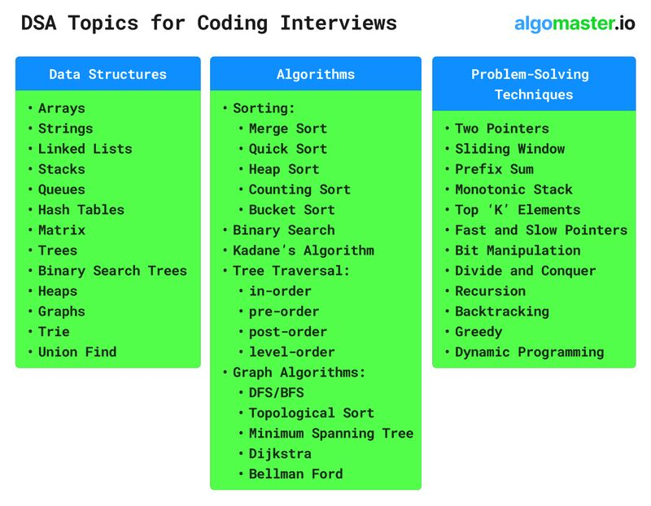

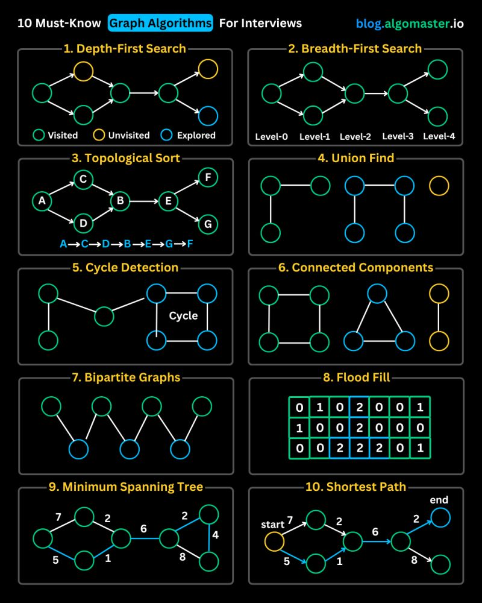

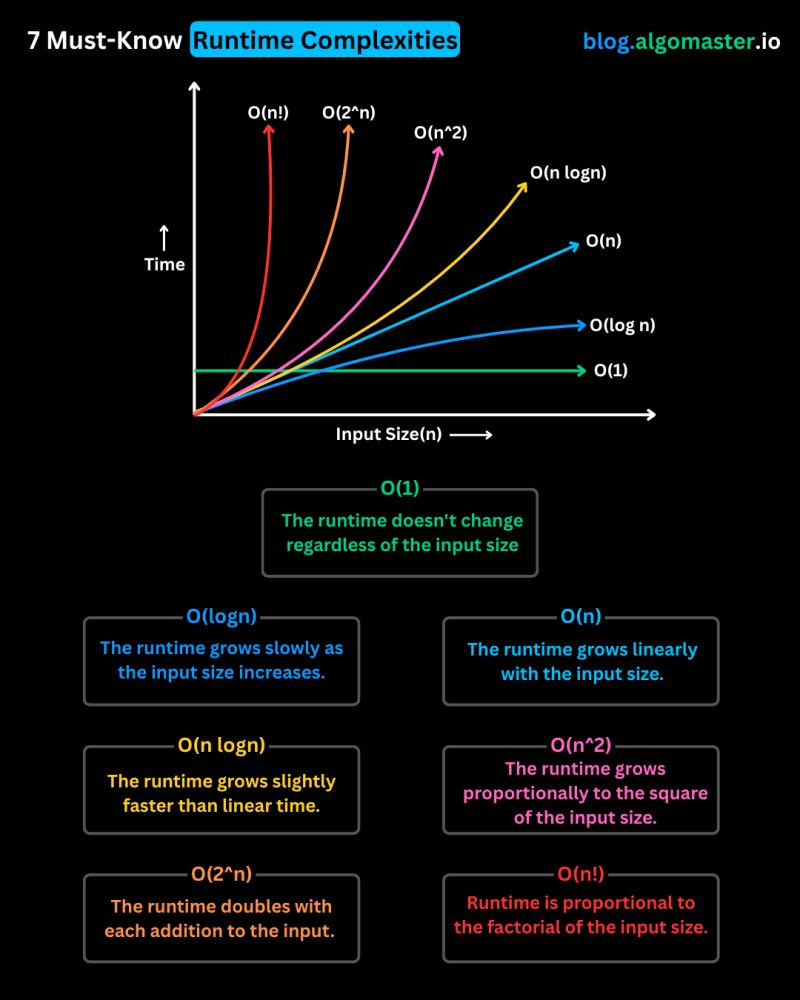

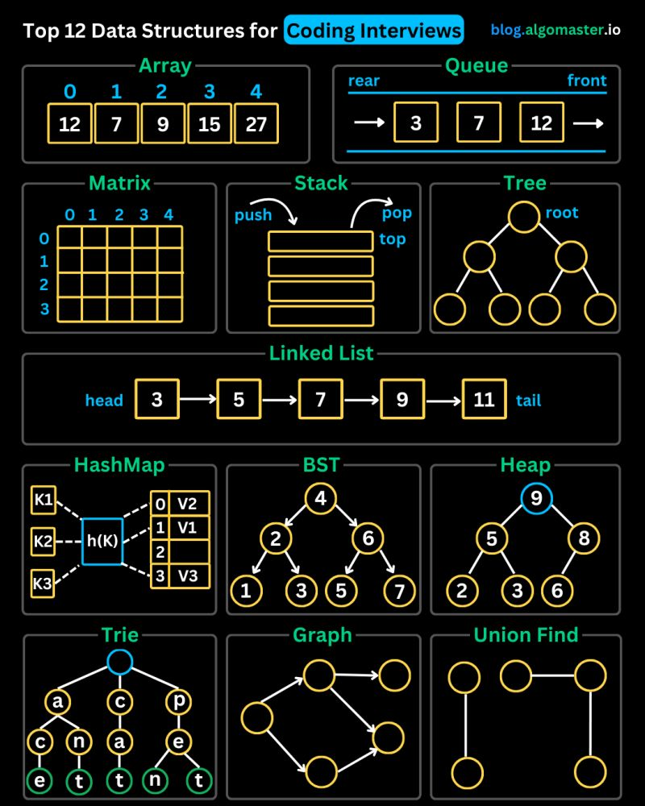

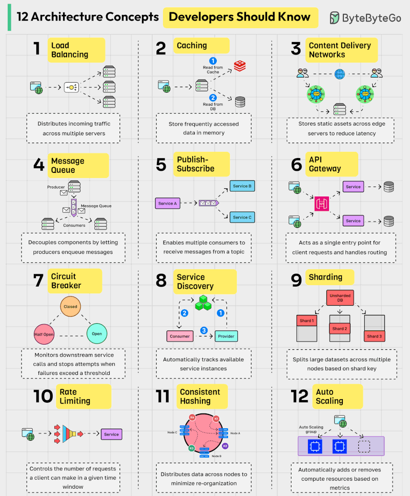

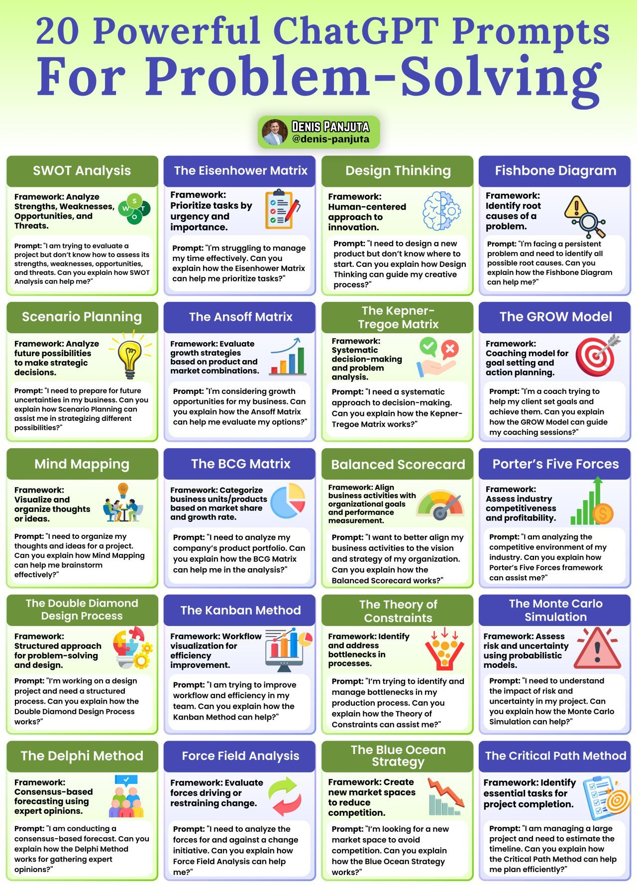

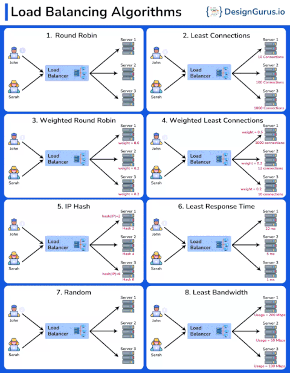

🌐 HTTP Status Codes — Small Topic, Big Interview Signal

Most candidates know HTTP status codes.
Very few know when and why to use them correctly.
And interviewers notice that difference.

In backend, system design, and API rounds, questions often sound like:
🔺 “What status code would you return here?”
🔺 “Why not 200?”
🔺 “Should this be 401 or 403?”

That’s where fundamentals matter.

A quick interview-oriented lens:
▶️ 200 / 201 / 202 → Success, but different meanings
▶️ 301 vs 302 → Permanent vs temporary decisions
▶️ 400 → Client sent bad data
▶️ 401 vs 403 → Authentication vs authorization (very common trap)
▶️ 404 vs 204 → Missing resource vs empty response
▶️ 5xx errors → Server-side responsibility (design & reliability signal)

Using the right status code shows:
✔ You understand APIs
✔ You think like a backend engineer
✔ You care about contracts and clarity

In interviews, this isn’t just HTTP knowledge, it’s a signal of engineering maturity.

If you’re preparing for backend or system design interviews, don’t skip the basics.

They’re often the easiest way to stand out.

Ankit Pangasa

Shoutout to Rajnish Kumar for calling out a typo for 204.

hashtag#BackendEngineering hashtag#SystemDesign hashtag#APIs hashtag#Interviews hashtag#SoftwareEngineering hashtag#WebDevelopment

