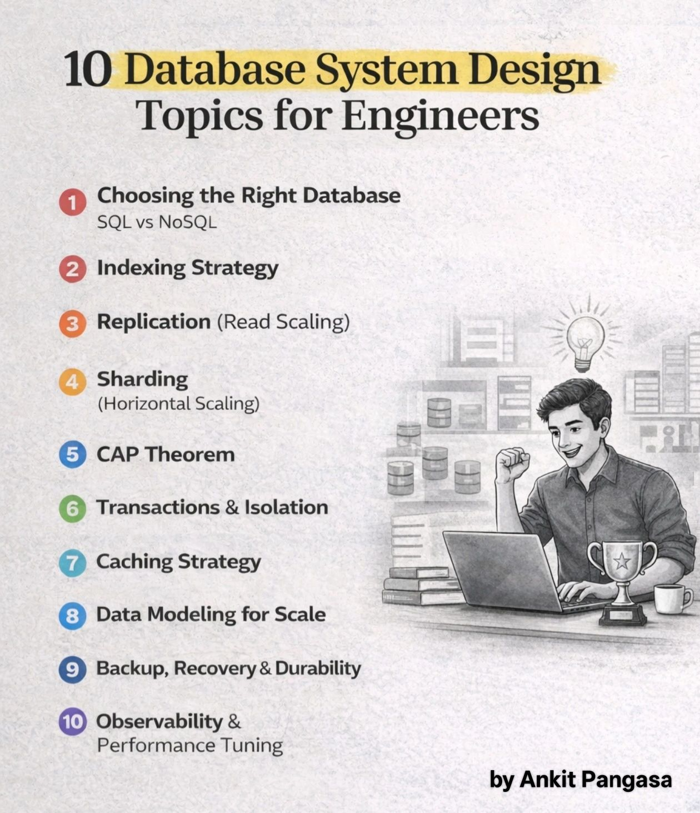
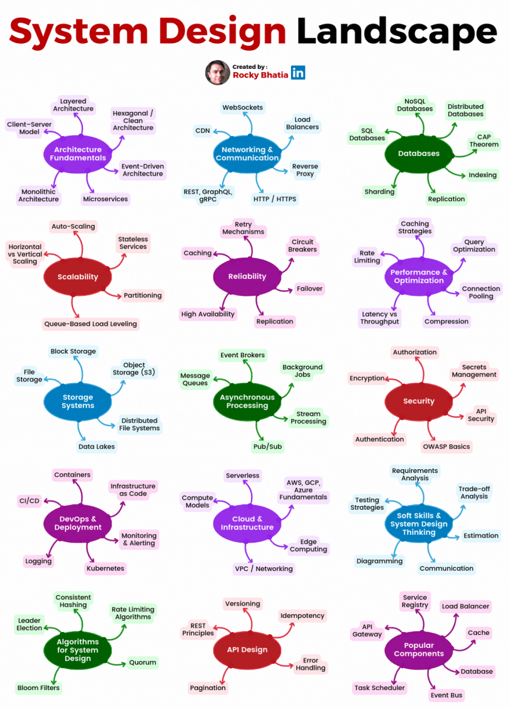
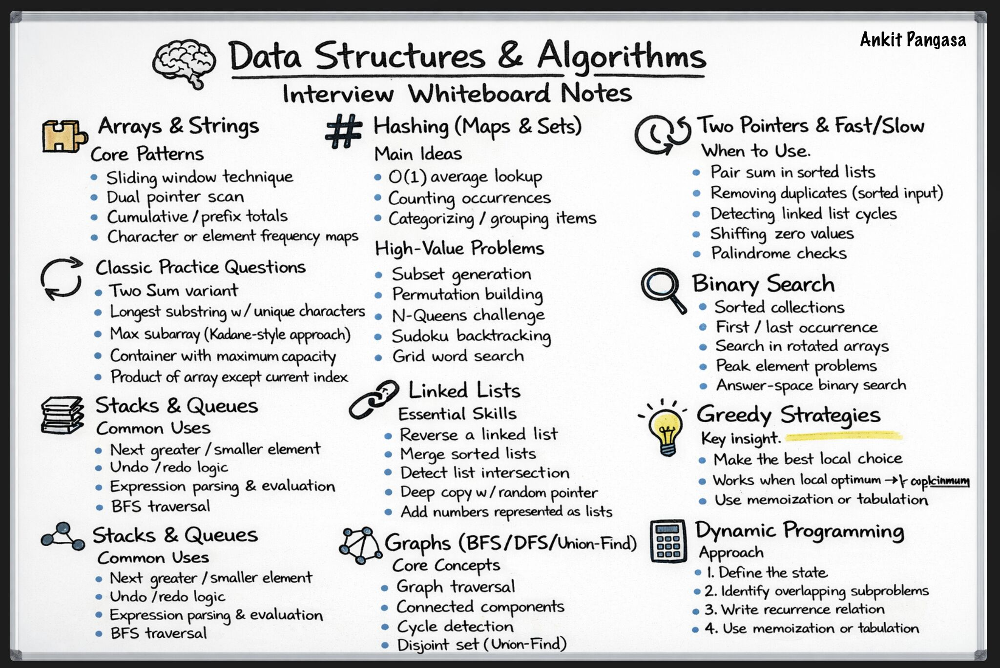

🌐 HTTP Status Codes — Small Topic, Big Interview Signal

Most candidates know HTTP status codes.
Very few know when and why to use them correctly.
And interviewers notice that difference.

In backend, system design, and API rounds, questions often sound like:
🔺 “What status code would you return here?”
🔺 “Why not 200?”
🔺 “Should this be 401 or 403?”

That’s where fundamentals matter.

A quick interview-oriented lens:
▶️ 200 / 201 / 202 → Success, but different meanings
▶️ 301 vs 302 → Permanent vs temporary decisions
▶️ 400 → Client sent bad data
▶️ 401 vs 403 → Authentication vs authorization (very common trap)
▶️ 404 vs 204 → Missing resource vs empty response
▶️ 5xx errors → Server-side responsibility (design & reliability signal)

Using the right status code shows:
✔ You understand APIs
✔ You think like a backend engineer
✔ You care about contracts and clarity

In interviews, this isn’t just HTTP knowledge, it’s a signal of engineering maturity.

If you’re preparing for backend or system design interviews, don’t skip the basics.

They’re often the easiest way to stand out.

Ankit Pangasa

Shoutout to Rajnish Kumar for calling out a typo for 204.

hashtag#BackendEngineering hashtag#SystemDesign hashtag#APIs hashtag#Interviews hashtag#SoftwareEngineering hashtag#WebDevelopment

Ankit PangasaAnkit Pangasa
   • FollowingPremium • Following
Engineering Manager at Adobe | Ex-Google | Breaking down interviews, system design & career growth | Sharing only verified job opportunities | Opinions my own | DM for collabEngineering Manager at Adobe | Ex-Google | Breaking down interviews, system design & career growth | Sharing only verified job opportunities | Opinions my own | DM for collab
3d •  3 days ago • Visible to anyone on or off LinkedIn
🔥 10 Database System Design Topics Every Engineer Must Master

If you're preparing for backend or system design interviews,
these are the database concepts that actually matter.

Not textbook theory.
Not outdated debates.
Real-world scaling knowledge.

Here’s the structured roadmap (in order):

1️⃣ Choosing the Right Database (SQL vs NoSQL)
https://lnkd.in/gCreh7_R

2️⃣ Indexing Strategy
https://lnkd.in/gQGv--ZA

3️⃣ Replication (Read Scaling)
https://lnkd.in/gKXxSbnM

4️⃣ Sharding (Horizontal Scaling)
https://lnkd.in/gqjkzgpw

5️⃣ CAP Theorem
https://lnkd.in/gqZxYD7R

6️⃣ Transactions & Isolation
https://lnkd.in/g8gQ58M3

7️⃣ Caching Strategy
https://lnkd.in/g6kd279M

8️⃣ Data Modeling for Scale
https://lnkd.in/gT9EJK2D

9️⃣ Backup, Recovery & Durability
https://lnkd.in/g89nekg5

🔟 Observability & Performance Tuning
https://lnkd.in/gxpFDYta

🎯 Why This Order Matters

This sequence mirrors how real systems scale:
* First choose the right DB
* Optimize with indexing
* Scale reads with replication
* Scale writes with sharding
* Understand distributed trade-offs (CAP)
* Handle consistency (transactions)
* Reduce load (caching)
* Model data for access patterns
* Ensure durability
* Monitor and tune performance

Master this flow → You’ll think like a system design engineer, not just a coder.

Ankit Pangasa

View Ankit Pangasa’s  graphic link
Ankit PangasaAnkit Pangasa
   • FollowingPremium • Following
Engineering Manager at Adobe | Ex-Google | Breaking down interviews, system design & career growth | Sharing only verified job opportunities | Opinions my own | DM for collabEngineering Manager at Adobe | Ex-Google | Breaking down interviews, system design & career growth | Sharing only verified job opportunities | Opinions my own | DM for collab
1w •  1 week ago • Visible to anyone on or off LinkedIn
🚀 System Design Landscape – The Bigger Picture

System Design isn’t just about databases or APIs — it’s a combination of architecture, scalability, reliability, security, and thoughtful trade-offs.

From:
🏗 Architecture Fundamentals (Monoliths, Microservices, Clean Architecture)
🌐 Networking & Communication (REST, gRPC, WebSockets, Load Balancers)
🗄 Databases (SQL, NoSQL, Sharding, Replication)
⚡ Performance & Caching
🔁 Reliability & High Availability
☁️ Cloud & DevOps
🔐 Security & API Design
🧠 Algorithms & Distributed Systems Concepts

Great system design is about understanding how all these pieces connect.
You don’t need to master everything at once — start small, build foundations, and layer knowledge over time.

Design systems that scale.
Build systems that last.
Think in trade-offs. 💡

Ankit Pangasa

Pic credit: Rocky Bhatia

hashtag#SystemDesign hashtag#SoftwareEngineering hashtag#Backend hashtag#Architecture hashtag#Cloud hashtag#Scalability

View Ankit Pangasa’s  graphic link
Ankit PangasaAnkit Pangasa
   • FollowingPremium • Following
Engineering Manager at Adobe | Ex-Google | Breaking down interviews, system design & career growth | Sharing only verified job opportunities | Opinions my own | DM for collabEngineering Manager at Adobe | Ex-Google | Breaking down interviews, system design & career growth | Sharing only verified job opportunities | Opinions my own | DM for collab
1w •  1 week ago • Visible to anyone on or off LinkedIn

DSA Interview Prep — What Actually Helped Me 🧠

Over time, I realized cracking coding interviews isn’t about solving 500 random problems.
It’s about mastering the core patterns.

Based on my experience, most interview questions fall into a few key buckets:
🔹 Arrays & Strings — Sliding window, two pointers, prefix sums
🔹 Hashing — Frequency maps & fast lookups
🔹 Linked Lists — Reversal, cycle detection
🔹 Stacks & Queues — Monotonic stack, BFS patterns
🔹 Binary Search — Not just on arrays, but on the answer itself
🔹 Recursion & Backtracking — Breaking problems into decision trees
🔹 Graphs — DFS, BFS, components
🔹 Greedy & DP — When to optimize locally vs build states

What changed things for me wasn’t grinding endlessly —
It was recognizing patterns faster and explaining my thought process clearly.

If you're preparing for interviews:
✅ Follow for practical DSA breakdowns based on real prep experience
✅ Save this and revisit it before your next interview
✅ Share it with someone who’s currently preparing

Consistency beats cramming. Every time. 🚀

Ankit Pangasa

hashtag#DSA hashtag#CodingInterview hashtag#SoftwareEngineering hashtag#InterviewPrep hashtag#LeetCode hashtag#TechCareers

